 

 

> **FaceSwap AI**: An AI creativity app: swap faces, generate videos, apply artistic styles and create images.

 

 

## Screens

Animated illustrations of the real screens (redrawn as vector graphics for this showcase).

 <b>Landing</b>

 <b>Features</b>

 

## Tech stack

## Related

The model-serving part is open: [**faceswap-api**](https://github.com/Sush-Singh/faceswap-api) (Python, Docker).

## About this repository

This repository is a **showcase** of FaceSwap AI: a README, screenshots and diagrams only. The source code is private.
You can use the live project at **[faceswap-app-sush-singhs-projects.vercel.app](https://faceswap-app-sush-singhs-projects.vercel.app)**.

Built by **[Sushant Kumar](https://www.linkedin.com/in/sushant-kumar-bb067b128/)** · [GitHub profile](https://github.com/Sush-Singh)
